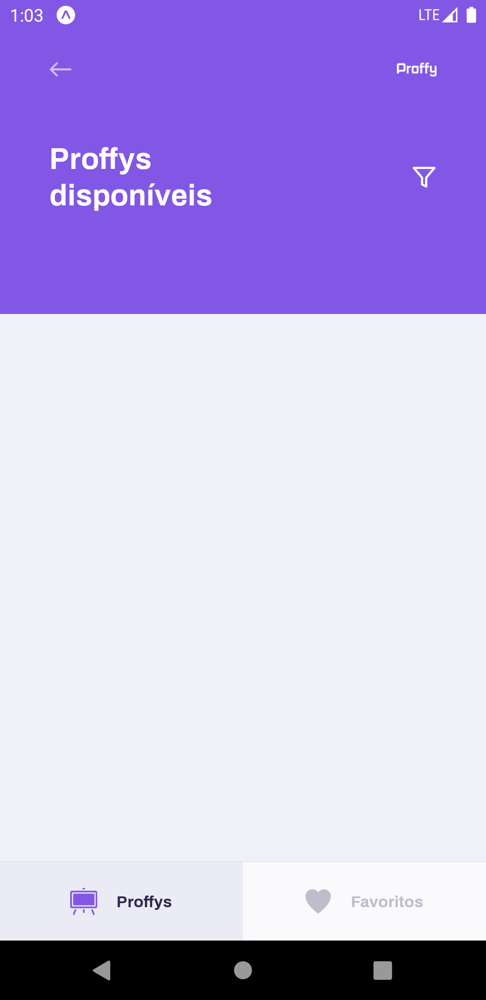
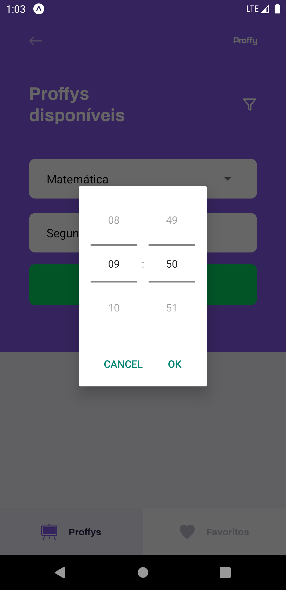

# Proffy

## Welcome to Proffy,

>### This project was developed during the **[NextLevelWeek](https://nextlevelweek.com/)#2** created by [**RocketSeat**](https://pages.github.com/) and its main objective is to connect students and teachers in a simple and practical way.

### Below are links to the Server, Web and Mobile codes, as well as some images from version 1.0

## View source code of:

## Images

  

  

  

  

  

  

  

  

  

  

